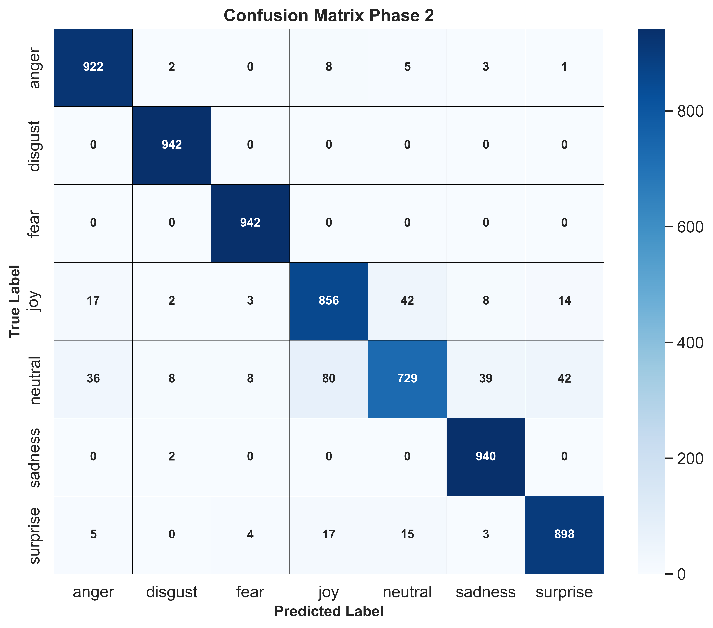
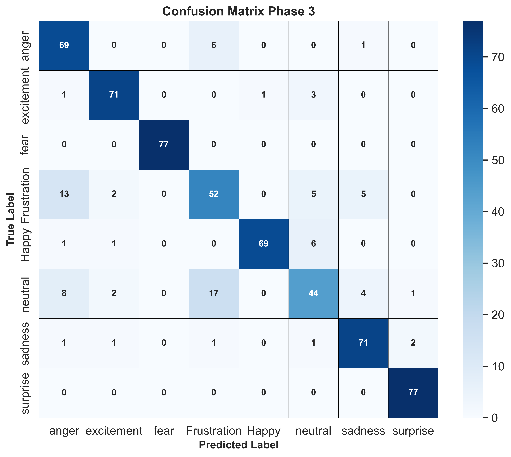
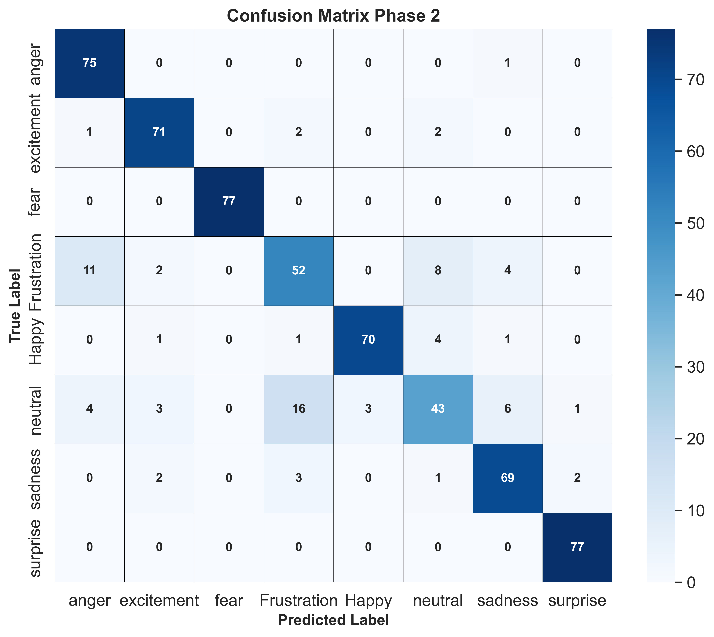
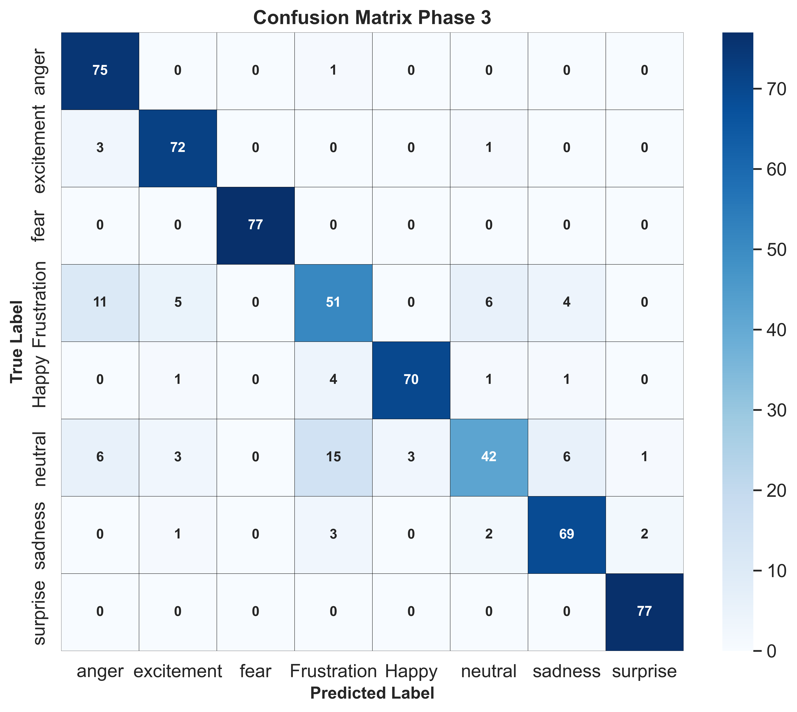

# A Unified Approach for Multimodal Emotion Recognition Using Counterfactual Learning

[](https://github.com/BLANK-2340/A-Unified-Approach-for-Multimodal-Emotion-Recognition-Using-Counterfactual-Learning.git)
[](https://python.org)
[](https://pytorch.org)
[](LICENSE)

## 📋 Overview

This repository contains the official implementation of **"A Unified Approach for Multimodal Emotion Recognition Using Counterfactual Learning"**, a novel framework designed to enhance multimodal emotion recognition through advanced sequential modeling and structured counterfactual learning.

### Key Features

- **🎯 State-of-the-Art Performance**: Achieves 94.87% weighted F1-score on MELD and 86.68% on IEMOCAP datasets
- **🔄 Three-Phase Training**: Progressive counterfactual learning with baseline training, alignment, and intention-guided refinement
- **🧠 Advanced Architecture**: Progressive BiLSTM modules with cross-attention fusion for comprehensive multimodal integration
- **📊 Robust Evaluation**: Comprehensive analysis with ROC curves, confusion matrices, and t-SNE visualizations
- **⚡ Efficient Processing**: Optimized for GPU training with mixed-precision support

### Architecture Highlights

- **Modality-Specific Feature Extraction**: RoBERTa (text), Wav2Vec2 (audio), ResNet-50 (visual)
- **Progressive BiLSTM**: Hierarchical temporal feature modeling with adaptive gating
- **Cross-Modal Attention**: All-pairs bidirectional attention for rich inter-modality fusion
- **Counterfactual Learning**: Novel three-phase training strategy for enhanced robustness

## 📊 Data

### Datasets

The framework is evaluated on two benchmark datasets for conversational emotion recognition:

#### MELD (Multimodal Emotion Lines Dataset)
- **Source**: Multi-party dialogues from Friends TV series
- **Emotions**: 7 classes (anger, disgust, fear, joy, neutral, sadness, surprise)
- **Modalities**: Text, audio, visual
- **Download**: [MELD Dataset](https://affective-meld.github.io/)

#### IEMOCAP (Interactive Emotional Dyadic Motion Capture)
- **Source**: Dyadic interactions between actors
- **Emotions**: 8 classes (angry, excited, fear, frustrated, happy, neutral, sad, surprised)
- **Modalities**: Text, audio, visual
- **Download**: [IEMOCAP Dataset](https://sail.usc.edu/iemocap/)

### Data Structure
```
data/
├── MELD/
│   ├── train/
│   ├── dev/
│   └── test/
└── IEMOCAP/
    ├── train/
    ├── dev/
    └── test/
```

## 🚀 Installation/Setup

### Prerequisites
- Python 3.8+
- CUDA-capable GPU (recommended)
- 16GB+ RAM

### Clone Repository
```bash
git clone https://github.com/BLANK-2340/A-Unified-Approach-for-Multimodal-Emotion-Recognition-Using-Counterfactual-Learning.git
cd A-Unified-Approach-for-Multimodal-Emotion-Recognition-Using-Counterfactual-Learning
```

### Install Dependencies
```bash
# Create virtual environment
python -m venv venv
source venv/bin/activate  # On Windows: venv\Scripts\activate

# Install required packages
pip install -r requirements.txt

# Install additional dependencies for audio processing
pip install librosa soundfile

# Install pre-trained models
python -c "from transformers import RobertaTokenizer, Wav2Vec2Processor; RobertaTokenizer.from_pretrained('roberta-base'); Wav2Vec2Processor.from_pretrained('facebook/wav2vec2-base-960h')"
```

### Environment Setup
```bash
# Set environment variables
export CUDA_VISIBLE_DEVICES=0
export TOKENIZERS_PARALLELISM=false
```

## 🎯 Usage

### Quick Start
```bash
# Train the model with default settings
python train.py --dataset MELD --batch_size 16 --epochs 40

# Evaluate trained model
python evaluate.py --model_path checkpoints/best_model.pth --dataset MELD

# Generate predictions
python predict.py --input_file data/sample.csv --output_file results/predictions.csv
```

### Training Configuration
```bash
# Custom training with specific parameters
python train.py \
    --dataset MELD \
    --batch_size 16 \
    --learning_rate 5e-5 \
    --weight_decay 0.01 \
    --phase1_epochs 15 \
    --phase2_epochs 15 \
    --phase3_epochs 10 \
    --save_dir checkpoints/
```

### Inference
```python
from model import MultimodalEmotionRecognizer
from utils import load_data, preprocess

# Load pre-trained model
model = MultimodalEmotionRecognizer.from_pretrained('checkpoints/best_model.pth')

# Process input data
text, audio, video = preprocess(input_data)

# Predict emotion
prediction = model.predict(text, audio, video)
print(f"Predicted emotion: {prediction}")
```

## 🔬 Methodology

Our approach integrates advanced sequential modeling with a novel three-phase counterfactual learning strategy to address key challenges in multimodal emotion recognition.

### 1. Overall Architecture
<div align="center">

</div>

**Architecture Overview**: The framework processes synchronized audio, visual, and textual data through three main components:

1. **Modality-Specific Feature Extraction**: Each modality (text, audio, video) is processed through dedicated pipelines:
   - **Text**: RoBERTa tokenization → contextual embeddings → Feature Transformation Block (FTB)
   - **Audio**: Wav2Vec2 voice embeddings + MFCC + spectral features → self-attention → combination
   - **Video**: Entropy-based frame selection → ResNet-50 → BiLSTM → multi-head attention

2. **Progressive BiLSTM Processing**: Each modality's features undergo hierarchical temporal modeling with adaptive gating mechanisms that progressively refine representations across multiple layers.

3. **Cross-Modal Fusion**: All-pairs bidirectional cross-attention mechanism facilitates rich information exchange between modalities, followed by standardization and MLP-based classification.

4. **Counterfactual Feature Generation (CFG)**: Generates minimally perturbed feature versions to enhance model robustness through the three-phase training strategy.

### 2. Cross-Attention Mechanism
<div align="center">

</div>

**Cross-Modal Attention (CMA)** enables bidirectional information exchange across all modality pairs. The mechanism computes attention weights between query features from one modality and key-value pairs from another:

```math
Q_{m_i} = W_Q^{m_1} F_{m_i}, \quad K_{m_j} = W_K^{m_2} F_{m_j}, \quad V_{m_j} = W_V^{m_2} F_{m_j}
```

```math
A_{m_i \rightarrow m_j} = \text{softmax}\left(\frac{Q_{m_i} K_{m_j}^T}{\sqrt{256}}\right) V_{m_j}
```

**Process Flow**:
1. **Six Attention Pairs**: (audio→video), (audio→text), (video→audio), (video→text), (text→audio), (text→video)
2. **Enhanced Features**: Each modality's original features are concatenated with cross-attended features from other modalities
3. **Standardization**: Features undergo layer normalization and dimensionality reduction for stable fusion

### 3. Three-Phase Counterfactual Training Strategy
<div align="center">

</div>

The training strategy progressively incorporates counterfactual reasoning to enhance model robustness:

**Phase 1: Base Model Training**
- Establishes baseline representations using standard multimodal fusion
- Loss function focuses on accurate emotion classification using Focal Loss to handle class imbalance

```math
\mathcal{L}_{Phase1} = \mathcal{L}_{Focal}(\hat{y}_{P1}, y_{True})
```

**Phase 2: Counterfactual Alignment**  
- Introduces counterfactual feature generation and alignment loss
- Encourages consistency between original and counterfactual representations of the same emotion class
- Uses contrastive learning to push apart different emotion classes

```math
\mathcal{L}_{Phase2} = \mathcal{L}_{Focal}(\hat{y}_{P2}, y_{True}) + \lambda_{align}(e) \cdot \mathcal{L}_{align}(H_{org}, H_{cf}, y_{True})
```

**Phase 3: Intention-Guided Refinement**
- Activates the Intention Predictor module for explicit counterfactual relationship modeling
- Focuses on high-confidence samples to refine decision boundaries
- Combines all three loss components with adaptive scheduling

```math
\mathcal{L}_{Phase3} = \mathcal{L}_{Focal} + \lambda_{align} \cdot \mathcal{L}_{align} + \lambda_{intent}(e) \cdot \mathcal{L}_{intent}
```

### 4. Intention Predictor Module
<div align="center">

</div>

**Purpose**: Models the relationship between original and counterfactual features to understand prediction rationale.

**Architecture**:
1. **Difference Computation**: Calculates feature difference between counterfactual and original representations
2. **Concatenation**: Combines difference vector with original features for context
3. **MLP Processing**: Three-layer MLP with dropout and layer normalization for intention prediction

```math
H_{diff} = H_{cf} - H_{org}
```

```math
\tilde{H}_{diff} = [H_{diff}; H_{org}] \in \mathbb{R}^{B \times 512}
```

```math
\hat{y}^{int} = \text{MLP}(\tilde{H}_{diff})
```

**Intention Loss**: Confidence-weighted cross-entropy with label smoothing, focusing on samples where the base model is already confident (confidence > 0.7).

### 5. Mathematical Formulations

**Progressive BiLSTM with Adaptive Gating**:
```math
H_{lstm}^{(i)} = \text{BiLSTM}^{(i)}(F^{(i-1)}) \in \mathbb{R}^{B \times SeqLen \times 2h}
```

```math
H_{attn}^{(i)} = \text{MultiHeadAttn}(H_{lstm}^{(i)}, H_{lstm}^{(i)}, H_{lstm}^{(i)}) \in \mathbb{R}^{B \times SeqLen \times 2h}
```

```math
G^{(i)} = \sigma(\text{Linear}(\text{Concat}(T^{(i)}, F^{(i-1)})))
```

```math
F^{(i)} = G^{(i)} \odot T^{(i)} + (1 - G^{(i)}) \odot F^{(i-1)}
```

**Alignment Loss (InfoNCE-based)**:
```math
S_{ij} = \frac{\langle \hat{F}_i, \hat{F}_{cf,j} \rangle}{\tau}
```

```math
\mathcal{L}_{align} = -\text{mean}_i \left( \log \frac{\exp(\sum_{j \in Pos(i)} S_{ij})}{\exp(\sum_{j \in Pos(i)} S_{ij}) + \exp(\sum_{k \in Neg(i)} [\max(S_{ik} + m, 0)])} \right)
```

Where τ = 0.1 (temperature), m = 0.5 (margin), and Pos(i)/Neg(i) represent positive/negative sample sets.

## 📈 Results

### Performance Comparison

Our framework achieves state-of-the-art results on both benchmark datasets:

| Dataset | Method | Accuracy (%) | Weighted F1 (%) |
|---------|--------|--------------|-----------------|
| **MELD** | MMGCN | 60.42 | 58.65 |
| | DER-GCN | 66.80 | 66.10 |
| | ELR-GNN | 68.70 | 69.90 |
| | AMuSE | 73.28 | 71.32 |
| | **Ours** | **94.99** | **94.87** |
| **IEMOCAP** | MMGCN | 67.40 | 66.22 |
| | DER-GCN | 69.70 | 69.40 |
| | ELR-GNN | 70.60 | 70.90 |
| | AMuSE | 74.49 | 73.91 |
| | **Ours** | **87.11** | **86.68** |

### Training Progress Analysis

<div align="center">

| MELD Dataset | IEMOCAP Dataset |
|:---:|:---:|
|  |  |
|  |  |

</div>

**Learning Curve Analysis**:
- **Phase 1 (Epochs 1-15)**: Rapid initial learning as the model establishes baseline multimodal representations
- **Phase 2 (Epochs 16-30)**: Steady improvement with counterfactual alignment, showing enhanced feature discriminability
- **Phase 3 (Epochs 31-40)**: Fine-tuning through intention prediction, achieving optimal performance on MELD

### ROC Curves Across Training Phases

#### MELD Dataset
<table align="center">
<tr>
<td align="center"><b>Phase 1</b></td>
<td align="center"><b>Phase 2</b></td>
<td align="center"><b>Phase 3</b></td>
</tr>
<tr>
<td></td>
<td></td>
<td></td>
</tr>
</table>

#### IEMOCAP Dataset
<table align="center">
<tr>
<td align="center"><b>Phase 1</b></td>
<td align="center"><b>Phase 2</b></td>
<td align="center"><b>Phase 3</b></td>
</tr>
<tr>
<td></td>
<td></td>
<td></td>
</tr>
</table>

**ROC Analysis**: 
- Progressive improvement in discriminative power across training phases
- **Phase 3 MELD**: AUC values exceeding 0.95 for all emotion classes, with near-perfect scores (AUC ≈ 1.0) for disgust and fear
- **Phase 2 IEMOCAP**: Optimal balance achieved with strong AUCs (>0.96) for most emotions
- **Class-specific insights**: Fear and surprise consistently show excellent discrimination, while neutral emotions remain challenging across datasets

### Confusion Matrix Evolution

#### MELD Dataset
<table align="center">
<tr>
<td align="center"><b>Phase 1</b></td>
<td align="center"><b>Phase 2</b></td>
<td align="center"><b>Phase 3</b></td>
</tr>
<tr>
<td></td>
<td></td>
<td></td>
</tr>
</table>

#### IEMOCAP Dataset
<table align="center">
<tr>
<td align="center"><b>Phase 1</b></td>
<td align="center"><b>Phase 2</b></td>
<td align="center"><b>Phase 3</b></td>
</tr>
<tr>
<td></td>
<td></td>
<td></td>
</tr>
</table>

**Confusion Matrix Insights**:
- **Diagonal Strengthening**: Clear improvement in diagonal concentration from Phase 1 to Phase 3
- **Error Reduction**: Significant reduction in off-diagonal misclassifications, particularly between similar emotions
- **Challenging Pairs**: Neutral-joy and frustration-anger confusions persist but decrease substantially
- **Perfect Classification**: Some emotions (fear, disgust) achieve near-perfect classification in final phases

### Feature Space Visualization with t-SNE

#### Cross-Attention Output Features (MELD)
<table align="center">
<tr>
<td align="center"><b>Phase 1</b></td>
<td align="center"><b>Phase 2</b></td>
<td align="center"><b>Phase 3</b></td>
</tr>
<tr>
<td></td>
<td></td>
<td></td>
</tr>
</table>

**Cross-Attention t-SNE Analysis**:
- **Phase 1**: Significant overlap between emotion clusters, indicating insufficient discriminative power
- **Phase 2**: Introduction of alignment loss creates more compact and distinct clusters for each emotion
- **Phase 3**: Clearest separation achieved with intention-guided refinement, showing well-defined emotion boundaries

#### Progressive BiLSTM Output Features (MELD)
<table align="center">
<tr>
<td colspan="3" align="center"><b>Phase 1</b></td>
</tr>
<tr>
<td align="center">Layer 1</td>
<td align="center">Layer 2</td>
<td align="center">Layer 3</td>
</tr>
<tr>
<td></td>
<td></td>
<td></td>
</tr>
<tr>
<td colspan="3" align="center"><b>Phase 2</b></td>
</tr>
<tr>
<td></td>
<td></td>
<td></td>
</tr>
<tr>
<td colspan="3" align="center"><b>Phase 3</b></td>
</tr>
<tr>
<td></td>
<td></td>
<td></td>
</tr>
</table>

**Progressive BiLSTM t-SNE Analysis**:
- **Hierarchical Learning**: Each BiLSTM layer progressively refines feature representations
- **Layer Evolution**: From Layer 1 to Layer 3, emotion clusters become increasingly well-separated
- **Phase Progression**: Counterfactual training (Phases 2-3) significantly enhances cluster formation across all layers
- **Temporal Dynamics**: The sequential nature of BiLSTM processing creates increasingly abstract and discriminative features

### Per-Class Performance Analysis

#### MELD Dataset (Phase 3)
| Emotion | Accuracy (%) | Precision (%) | Recall (%) | F1-Score (%) |
|---------|--------------|---------------|------------|--------------|
| Anger | 98.85 | 93.82 | 98.41 | 96.06 |
| Disgust | 99.83 | 98.85 | 100.00 | 99.42 |
| Fear | 99.83 | 98.85 | 100.00 | 99.42 |
| Joy | 97.42 | 90.04 | 92.14 | 91.08 |
| Neutral | 96.04 | 93.05 | 78.13 | 84.94 |
| Sadness | 99.32 | 95.63 | 99.79 | 97.66 |
| Surprise | 98.70 | 94.49 | 96.50 | 95.48 |

#### IEMOCAP Dataset (Phase 2)
| Emotion | Accuracy (%) | Precision (%) | Recall (%) | F1-Score (%) |
|---------|--------------|---------------|------------|--------------|
| Anger | 97.23 | 82.42 | 98.68 | 89.82 |
| Excitement | 97.88 | 89.87 | 93.42 | 91.61 |
| Fear | 100.00 | 100.00 | 100.00 | 100.00 |
| Frustration | 92.33 | 70.27 | 67.53 | 68.87 |
| Happy | 98.37 | 95.89 | 90.91 | 93.33 |
| Neutral | 92.17 | 74.14 | 56.58 | 64.18 |
| Sad | 96.74 | 85.19 | 89.61 | 87.34 |
| Surprised | 99.51 | 96.25 | 100.00 | 98.08 |

**Performance Insights**:
- **Excellent Recognition**: Fear, disgust, and surprise achieve near-perfect performance due to distinct multimodal signatures
- **Challenging Classes**: Neutral and frustration show lower performance due to subtle expression patterns and overlap with other emotions
- **Multimodal Advantage**: High-arousal emotions (anger, surprise) benefit significantly from combined audio-visual cues
- **Dataset Differences**: MELD shows more balanced performance across classes, while IEMOCAP exhibits greater variation

## 📋 File Structure

```
├── Counterfactual_Training_Run/     # Main training scripts and implementations
│   ├── train.py                     # Training pipeline
│   ├── model.py                     # Model architecture
│   └── losses.py                    # Loss functions
├── Video_vector/                    # Video feature extraction modules
│   ├── frame_extraction.py         # Entropy-based frame selection
│   ├── resnet_features.py          # ResNet-50 feature extraction
│   └── video_lstm.py               # BiLSTM for video sequences
├── Audio_vector/                    # Audio feature processing modules
│   ├── wav2vec_features.py         # Wav2Vec2 voice embeddings
│   ├── mfcc_extraction.py          # MFCC coefficient extraction
│   └── spectral_features.py        # Spectral feature computation
├── Text_vector/                     # Text feature processing modules
│   ├── roberta_features.py         # RoBERTa text embeddings
│   └── text_preprocessing.py       # Text preprocessing utilities
├── images/                          # Visualization results and figures
│   ├── Architecture diagrams/      # Model architecture illustrations
│   ├── ROC curves/                 # ROC analysis across phases
│   ├── Confusion matrices/         # Classification performance matrices
│   ├── t-SNE visualizations/       # Feature space visualizations
│   └── Learning curves/            # Training progress plots
├── model/                           # Core model architecture components
│   ├── progressive_bilstm.py       # Progressive BiLSTM implementation
│   ├── cross_attention.py          # Cross-modal attention mechanism
│   ├── counterfactual_generator.py # CFG module
│   └── intention_predictor.py      # Intention prediction module
├── utils/                           # Utility functions and helpers
│   ├── data_loader.py              # Dataset loading and preprocessing
│   ├── metrics.py                  # Evaluation metrics
│   └── visualization.py            # Plotting and visualization tools
├── config/                          # Configuration files
│   ├── meld_config.yaml            # MELD dataset configuration
│   └── iemocap_config.yaml         # IEMOCAP dataset configuration
├── requirements.txt                 # Python dependencies
└── README.md                        # Project documentation
```

## 💡 Key Contributions

1. **Novel Progressive Architecture**: Modality-specific Progressive BiLSTM with internal self-attention and adaptive gating mechanisms for hierarchical temporal modeling that captures complex intra-modal dynamics

2. **Three-Phase Counterfactual Learning**: Structured training strategy incorporating:
   - **Phase 1**: Baseline multimodal fusion establishment
   - **Phase 2**: Counterfactual alignment for enhanced feature discriminability
   - **Phase 3**: Intention-guided refinement for explicit counterfactual relationship modeling

3. **Comprehensive Cross-Modal Fusion**: All-pairs bidirectional attention mechanism enabling rich information exchange between text, audio, and visual modalities through six distinct attention pathways

4. **State-of-the-Art Performance**: Achieving significant improvements over existing methods:
   - **21.55% improvement** in F1-score on MELD dataset
   - **12.77% improvement** in F1-score on IEMOCAP dataset

5. **Robust Feature Learning**: Enhanced discriminability and generalization through counterfactual reasoning, demonstrated via comprehensive t-SNE visualizations showing progressive cluster formation

## 🔧 Technical Specifications

- **Framework**: PyTorch 1.9.0+ with CUDA support
- **Model Size**: 105.3M trainable parameters
- **Computational Complexity**: 23.31 GFLOPs
- **Optimization**: AdamW optimizer with phase-specific learning rate scheduling
- **Training Features**: 
  - Mixed-precision training (FP16) for memory efficiency
  - Gradient clipping (max norm: 1.0) for stability
  - Early stopping with patience monitoring
  - Automatic gradient accumulation

## 📞 Contact/Authors

**Armaan Singh**  
Department of Electronics and Communication Engineering  
Delhi Technological University, Delhi, India

**Chhavi Dhiman**  
Department of Electronics and Communication Engineering  
Delhi Technological University, Delhi, India

---


## 📜 License

This project is licensed under the MIT License - see the [LICENSE](LICENSE) file for details.

## 🙏 Acknowledgments

- Delhi Technological University for computational resources and research support
- The creators of MELD and IEMOCAP datasets for providing benchmark evaluation platforms
- The open-source community for valuable tools, libraries, and pre-trained models
- The research community for foundational work in multimodal emotion recognition and counterfactual learning

---

<div align="center">

**[⭐ Star this repository](https://github.com/BLANK-2340/A-Unified-Approach-for-Multimodal-Emotion-Recognition-Using-Counterfactual-Learning.git) if you find it helpful!**

</div>
