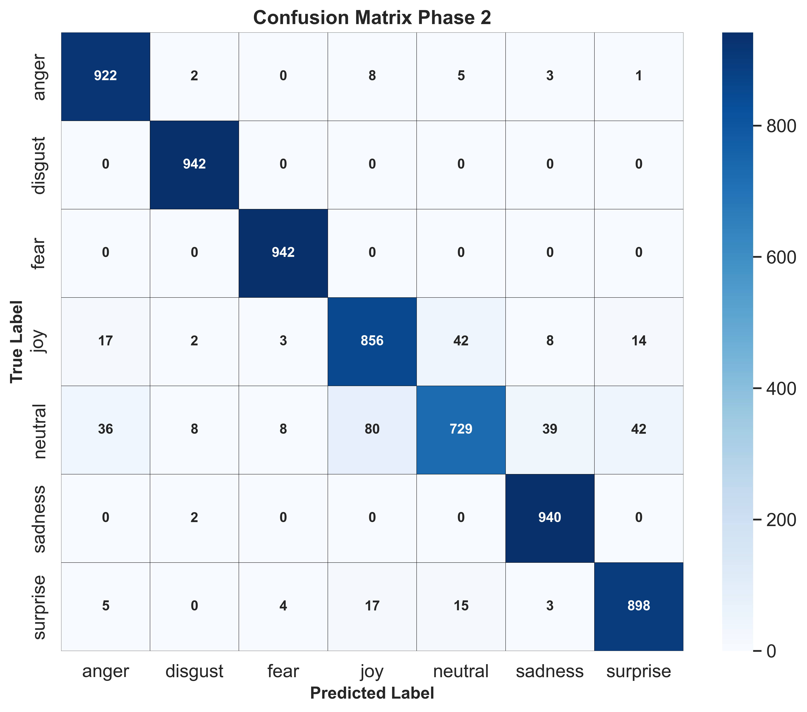
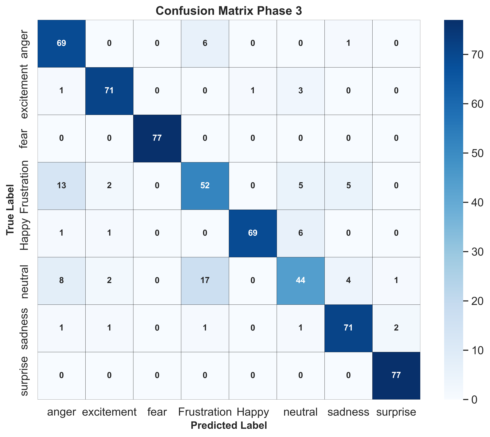
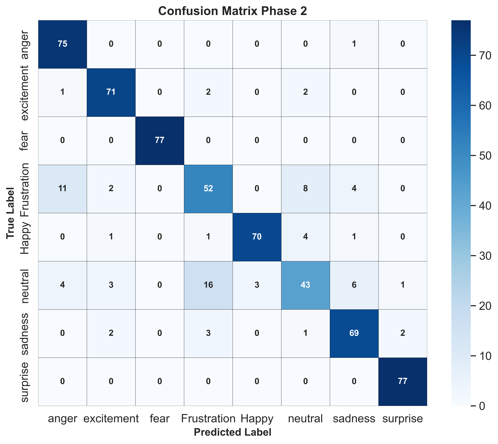
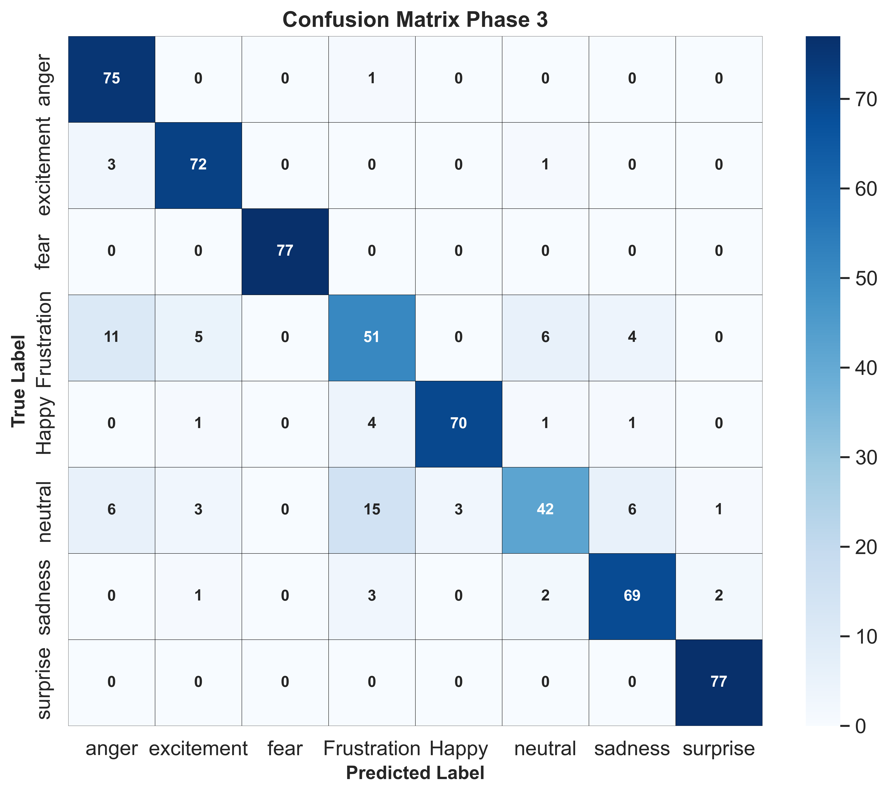

# A Unified Approach for Multimodal Emotion Recognition Using Counterfactual Learning

[](https://github.com/BLANK-2340/A-Unified-Approach-for-Multimodal-Emotion-Recognition-Using-Counterfactual-Learning.git)
[](https://python.org)
[](https://pytorch.org)
[](LICENSE)

## Overview

This repository contains the official implementation of **“A Unified Approach for Multimodal Emotion Recognition Using Counterfactual Learning”**, a multimodal emotion recognition framework for conversational affective computing.

The method combines modality-specific feature extraction, Progressive BiLSTM-based temporal refinement, bidirectional cross-modal attention, and a three-phase counterfactual training strategy. The framework is designed to improve robustness against modality imbalance, signal noise, class imbalance, and missing-modality conditions.

The proposed model is evaluated on the **MELD** and **IEMOCAP** benchmark datasets.

---

## Highlights

- **Three-phase counterfactual training**
  - Phase 1: Base multimodal model training
  - Phase 2: Counterfactual alignment
  - Phase 3: Intention-guided refinement

- **Multimodal feature extraction**
  - Text: RoBERTa-based contextual representations
  - Audio: Wav2Vec2 embeddings, MFCC features, and spectral descriptors
  - Video: ResNet-50 frame-level features with temporal processing

- **Progressive BiLSTM refinement**
  - Hierarchical temporal modelling
  - Internal self-attention
  - Adaptive gated residual refinement

- **Bidirectional cross-modal attention**
  - All-pairs interaction among text, audio, and visual modalities
  - Standardized modality representations before fusion

- **Counterfactual robustness**
  - Feature-level counterfactual interventions
  - Alignment loss for factual-counterfactual consistency
  - Intention predictor for intervention-aware refinement

- **Robustness under modality corruption**
  - Evaluated under No-Text, No-Audio, No-Visual, and Heavy-Noise settings
  - Designed to reduce modality dominance and prevent mode collapse

---

## Repository Status

This repository is intended to support reproducibility for the manuscript. It includes:

- Source code for text, audio, and visual feature extraction
- Counterfactual training implementation
- Model visualizations and training/evaluation plots
- Dataset setup instructions
- Dependency file through `requirements.txt`
- Pre-trained checkpoint link for inference and analysis

> Note: MELD and IEMOCAP are not redistributed in this repository due to dataset licensing. Please download them from their official sources and arrange them according to the structure below.

---

## Datasets

### MELD: Multimodal EmotionLines Dataset

- **Source:** Multi-party dialogue clips from the TV series *Friends*
- **Modalities:** Text, audio, video
- **Emotion classes:** anger, disgust, fear, joy, neutral, sadness, surprise
- **Official link:** [MELD Dataset](https://affective-meld.github.io/)

### IEMOCAP: Interactive Emotional Dyadic Motion Capture

- **Source:** Scripted and improvised dyadic interactions between actors
- **Modalities:** Text, audio, video
- **Emotion classes:** angry, excited, fear, frustrated, happy, neutral, sad, surprised
- **Official link:** [IEMOCAP Dataset](https://sail.usc.edu/iemocap/)

---

## Recommended Data Layout

After downloading the datasets, organize them as follows:

```text
data/
├── MELD/
│   ├── train/
│   ├── dev/
│   ├── test/
│   └── annotations/
└── IEMOCAP/
    ├── train/
    ├── dev/
    ├── test/
    └── annotations/
```

The feature extraction scripts generate tabular feature files that are used by the training pipeline. The expected feature groups are:

| Feature group | Description | Source script |
|---|---|---|
| `V1` | Wav2Vec2 voice embedding | `Audio_vector.py` |
| `V3` | MFCC feature vector | `Audio_vector.py` |
| `V4` | Spectral descriptor vector | `Audio_vector.py` |
| `A2` | Visual feature vector from ResNet-50 + LSTM | `Video_vector.py` |
| Text features | Utterance-level contextual representation | Training pipeline / `Text_vector.py` utility |

---

## Installation

### 1. Clone the repository

```bash
git clone https://github.com/BLANK-2340/A-Unified-Approach-for-Multimodal-Emotion-Recognition-Using-Counterfactual-Learning.git
cd A-Unified-Approach-for-Multimodal-Emotion-Recognition-Using-Counterfactual-Learning
```

### 2. Create a virtual environment

```bash
python -m venv venv
```

Activate the environment:

```bash
# Linux / macOS
source venv/bin/activate
```

```bash
# Windows
venv\Scripts\activate
```

### 3. Install dependencies

```bash
pip install --upgrade pip
pip install -r requirements.txt
```

### 4. Install FFmpeg

Audio extraction from video files requires FFmpeg.

```bash
# Ubuntu / Debian
sudo apt-get install ffmpeg
```

```bash
# macOS with Homebrew
brew install ffmpeg
```

For Windows, install FFmpeg from the official website and add it to your system PATH.

### 5. Download pretrained backbones

The required pretrained models are automatically downloaded by Hugging Face and TorchVision when the scripts are first executed. You can also pre-cache them:

```bash
python -c "from transformers import RobertaTokenizer, RobertaModel, Wav2Vec2Processor, Wav2Vec2Model; RobertaTokenizer.from_pretrained('roberta-base'); RobertaModel.from_pretrained('roberta-base'); Wav2Vec2Processor.from_pretrained('facebook/wav2vec2-base-960h'); Wav2Vec2Model.from_pretrained('facebook/wav2vec2-base-960h')"
```

---

## Usage

### Step 1: Prepare dataset paths

Before running the scripts, update the path variables inside the following files:

```text
Audio_vector.py
Video_vector.py
Text_vector.py
Counterfactual Training Run.py
```

Replace placeholder values such as:

```python
YOUR_VIDEO_SAMPLES_PATH
YOUR_OUTPUT_EXCEL_PATH
YOUR_UTTERANCES_DF_PATH
path file
```

with the correct local paths for your dataset and output directories.

---

### Step 2: Extract audio features

```bash
python Audio_vector.py
```

This script extracts:

- Wav2Vec2 voice embeddings
- MFCC features
- Spectral centroid, zero crossing rate, RMS energy, tempo, and pitch-based spectral features

The output is saved as an Excel file containing audio feature vectors.

---

### Step 3: Extract visual features

```bash
python Video_vector.py
```

This script extracts:

- Representative frames from each video
- ResNet-50 frame-level embeddings
- LSTM-based temporal visual representation

The output is saved as an Excel file containing visual feature vectors.

---

### Step 4: Extract or prepare text features

```bash
python Text_vector.py
```

This utility script prepares utterance-level text vectors for experiments requiring precomputed text features. The final training pipeline uses contextual text representations consistent with the manuscript architecture.

---

### Step 5: Run counterfactual training

```bash
python "Counterfactual Training Run.py"
```

Inside the training script, set:

```python
SELECTED_DATASET = "MELD"
```

or

```python
SELECTED_DATASET = "IEMOCAP"
```

depending on the dataset being used.

The training process follows three phases:

| Phase | Objective | Main loss terms |
|---|---|---|
| Phase 1 | Base model training | Focal loss |
| Phase 2 | Counterfactual alignment | Focal loss + alignment loss |
| Phase 3 | Intention-guided refinement | Focal loss + alignment loss + intention loss |

---

## Pre-trained Model

A pre-trained model checkpoint is available here:

[Download Pre-trained Model](https://drive.google.com/drive/folders/1m23dhVmHV6o7zT3ltHukS3MufyT2bRgP?usp=sharing)

After downloading the checkpoint, place it in:

```text
checkpoints/
```

Example:

```text
checkpoints/
└── best_model.pth
```

---

## Methodology

The proposed architecture processes synchronized text, audio, and visual signals through modality-specific feature extraction pipelines, Progressive BiLSTM modules, bidirectional cross-modal attention, and a counterfactual training branch.

### 1. Overall Architecture

<div align="center">

</div>

The framework consists of four main stages:

1. **Modality-specific feature extraction**
   - Text features from RoBERTa
   - Audio features from Wav2Vec2, MFCC, and spectral descriptors
   - Visual features from entropy-based frame selection, ResNet-50, and LSTM

2. **Progressive BiLSTM feature learning**
   - Each modality is refined through recurrent temporal modelling
   - Internal self-attention captures long-range temporal cues
   - Adaptive gating prevents representational drift

3. **Cross-modal attention fusion**
   - Six bidirectional attention interactions are computed across text, audio, and visual modalities
   - Enhanced modality features are standardized before fusion

4. **Counterfactual training**
   - The Counterfactual Feature Generator produces bounded feature-level interventions
   - Alignment and intention losses enforce factual-counterfactual consistency

---

### 2. Cross-Attention Mechanism

<div align="center">

</div>

Cross-Modal Attention (CMA) enables bidirectional information exchange across all modality pairs.

```math
Q_{m_i} = W_Q^{m_i}F_{m_i}, \quad K_{m_j} = W_K^{m_j}F_{m_j}, \quad V_{m_j} = W_V^{m_j}F_{m_j}
```

```math
A_{m_i \rightarrow m_j} =
\text{softmax}\left(\frac{Q_{m_i}K_{m_j}^{T}}{\sqrt{256}}\right)V_{m_j}
```

The model applies attention across the following six directed pairs:

```text
audio → video
audio → text
video → audio
video → text
text  → audio
text  → video
```

---

### 3. Three-Phase Counterfactual Training

<div align="center">

</div>

The training pipeline is organized into three stages.

#### Phase 1: Base Model Training

The base multimodal model is trained using focal loss.

```math
\mathcal{L}_{Phase1} =
\mathcal{L}_{Focal}(\hat{y}_{P1}, y_{True})
```

#### Phase 2: Counterfactual Alignment

Counterfactual features are generated and aligned with factual representations.

```math
\mathcal{L}_{Phase2} =
\mathcal{L}_{Focal}(\hat{y}_{P2}, y_{True})
+
\lambda_{align}(e)\mathcal{L}_{align}(H_{org}, H_{cf}, y_{True})
```

#### Phase 3: Intention-Guided Refinement

The Intention Predictor is activated to model the effect of counterfactual interventions.

```math
\mathcal{L}_{Phase3} =
\mathcal{L}_{Focal}
+
\lambda_{align}\mathcal{L}_{align}
+
\lambda_{intent}(e)\mathcal{L}_{intent}
```

---

### 4. Intention Predictor Module

<div align="center">

</div>

The Intention Predictor models the relationship between original and counterfactual fused representations.

```math
H_{diff} = H_{cf} - H_{org}
```

```math
\tilde{H}_{diff} = [H_{diff}; H_{org}] \in \mathbb{R}^{B \times 512}
```

```math
\hat{y}^{int} = \text{MLP}(\tilde{H}_{diff})
```

The intention loss is a confidence-weighted cross-entropy loss with label smoothing. It focuses on samples for which the base classifier is already confident, encouraging the model to learn intervention-aware decision boundaries.

---

### 5. Progressive BiLSTM with Adaptive Gating

```math
H_{lstm}^{(i)} =
\text{BiLSTM}^{(i)}(F^{(i-1)})
\in \mathbb{R}^{B \times SeqLen \times 2h}
```

```math
H_{attn}^{(i)} =
\text{MultiHeadAttn}(H_{lstm}^{(i)}, H_{lstm}^{(i)}, H_{lstm}^{(i)})
```

```math
G^{(i)} =
\sigma(\text{Linear}(\text{Concat}(T^{(i)}, F^{(i-1)})))
```

```math
F^{(i)} =
G^{(i)} \odot T^{(i)}
+
(1-G^{(i)}) \odot F^{(i-1)}
```

This gated residual formulation allows the model to refine modality-specific temporal representations without overwriting useful lower-level affective cues.

---

### 6. Alignment Loss

The alignment loss encourages factual and counterfactual representations of semantically similar samples to remain close while separating unrelated emotional classes.

```math
S_{ij} =
\frac{\langle \hat{F}_i, \hat{F}_{cf,j} \rangle}{\tau}
```

```math
\mathcal{L}_{align}
=
-\text{mean}_i
\left[
\log
\frac{
\exp(\sum_{j \in Pos(i)}S_{ij})
}{
\exp(\sum_{j \in Pos(i)}S_{ij})
+
\exp(\sum_{k \in Neg(i)}[\max(S_{ik}+m,0)])
}
\right]
```

where:

- `τ = 0.1` is the temperature parameter
- `m = 0.5` is the margin
- `Pos(i)` denotes positive samples sharing the same emotion label
- `Neg(i)` denotes samples belonging to different emotion classes

---

## Results

### Overall Performance

| Dataset | Accuracy (%) | Weighted F1 (%) |
|---|---:|---:|
| MELD | **94.99** | **94.87** |
| IEMOCAP | **87.11** | **86.68** |

### Comparison with Existing Methods

| Dataset | Method | Accuracy (%) | Weighted F1 (%) |
|---|---|---:|---:|
| **MELD** | MMGCN | 60.42 | 58.65 |
|  | DER-GCN | 66.80 | 66.10 |
|  | ELR-GNN | 68.70 | 69.90 |
|  | AMuSE | 73.28 | 71.32 |
|  | **Ours** | **94.99** | **94.87** |
| **IEMOCAP** | MMGCN | 67.40 | 66.22 |
|  | DER-GCN | 69.70 | 69.40 |
|  | ELR-GNN | 70.60 | 70.90 |
|  | AMuSE | 74.49 | 73.91 |
|  | **Ours** | **87.11** | **86.68** |

---

## Robustness Under Modality Corruption

The revised manuscript evaluates robustness under:

1. **Missing-modality masking**
   - No-Text
   - No-Audio
   - No-Visual

2. **Heavy feature corruption**
   - Additive Gaussian noise with `σ = 2.0`

The robustness analysis reports:

- **Stability (%)**: fraction of predictions under corruption that match clean-input predictions
- **Unique Classes (U)**: number of distinct emotion classes predicted under corruption

A low value of `U` indicates reduced discriminative diversity. In particular, `U = 1` indicates mode collapse.

### Multimodal Stability and Discriminative Capacity

Format: `Stability (%) / Unique Classes (U)`

| Dataset | Model | Clean (U) | No-Text | No-Audio | No-Visual | Heavy Noise |
|---|---|---:|---:|---:|---:|---:|
| IEMOCAP | Phase 1 Baseline | 3 | 78/1 | 88/2 | 82/2 | 79/1 |
| IEMOCAP | Phase 3 Proposed | 3 | 96/3 | 100/3 | 98/3 | 100/3 |
| MELD | Phase 1 Baseline | 3 | 76/1 | 92/2 | 89/2 | 85/1 |
| MELD | Phase 3 Proposed | 3 | 99/3 | 100/3 | 100/3 | 100/3 |

These results show that the proposed counterfactual training strategy prevents collapse into a single dominant class under severe modality corruption. The Phase 3 model preserves full class diversity (`U = 3`) across all tested perturbation conditions.

---

## Training Progress Analysis

<div align="center">

| MELD Dataset | IEMOCAP Dataset |
|:---:|:---:|
|  |  |
|  |  |

</div>

### Learning Curve Observations

- **Phase 1:** The model rapidly learns baseline multimodal representations.
- **Phase 2:** Counterfactual alignment improves feature compactness and separability.
- **Phase 3:** Intention-guided refinement improves final discriminative stability.

---

## ROC Curves Across Training Phases

### MELD Dataset

<table align="center">
<tr>
<td align="center"><b>Phase 1</b></td>
<td align="center"><b>Phase 2</b></td>
<td align="center"><b>Phase 3</b></td>
</tr>
<tr>
<td></td>
<td></td>
<td></td>
</tr>
</table>

### IEMOCAP Dataset

<table align="center">
<tr>
<td align="center"><b>Phase 1</b></td>
<td align="center"><b>Phase 2</b></td>
<td align="center"><b>Phase 3</b></td>
</tr>
<tr>
<td></td>
<td></td>
<td></td>
</tr>
</table>

---

## Confusion Matrix Evolution

### MELD Dataset

<table align="center">
<tr>
<td align="center"><b>Phase 1</b></td>
<td align="center"><b>Phase 2</b></td>
<td align="center"><b>Phase 3</b></td>
</tr>
<tr>
<td></td>
<td></td>
<td></td>
</tr>
</table>

### IEMOCAP Dataset

<table align="center">
<tr>
<td align="center"><b>Phase 1</b></td>
<td align="center"><b>Phase 2</b></td>
<td align="center"><b>Phase 3</b></td>
</tr>
<tr>
<td></td>
<td></td>
<td></td>
</tr>
</table>

---

## Feature Space Visualization with t-SNE

### Cross-Attention Output Features: MELD

<table align="center">
<tr>
<td align="center"><b>Phase 1</b></td>
<td align="center"><b>Phase 2</b></td>
<td align="center"><b>Phase 3</b></td>
</tr>
<tr>
<td></td>
<td></td>
<td></td>
</tr>
</table>

### Progressive BiLSTM Output Features: MELD

<table align="center">
<tr>
<td colspan="3" align="center"><b>Phase 1</b></td>
</tr>
<tr>
<td align="center">Layer 1</td>
<td align="center">Layer 2</td>
<td align="center">Layer 3</td>
</tr>
<tr>
<td></td>
<td></td>
<td></td>
</tr>
<tr>
<td colspan="3" align="center"><b>Phase 2</b></td>
</tr>
<tr>
<td></td>
<td></td>
<td></td>
</tr>
<tr>
<td colspan="3" align="center"><b>Phase 3</b></td>
</tr>
<tr>
<td></td>
<td></td>
<td></td>
</tr>
</table>

---

## Per-Class Performance

### MELD Dataset: Phase 3

| Emotion | Accuracy (%) | Precision (%) | Recall (%) | F1-Score (%) |
|---|---:|---:|---:|---:|
| Anger | 98.85 | 93.82 | 98.41 | 96.06 |
| Disgust | 99.83 | 98.85 | 100.00 | 99.42 |
| Fear | 99.83 | 98.85 | 100.00 | 99.42 |
| Joy | 97.42 | 90.04 | 92.14 | 91.08 |
| Neutral | 96.04 | 93.05 | 78.13 | 84.94 |
| Sadness | 99.32 | 95.63 | 99.79 | 97.66 |
| Surprise | 98.70 | 94.49 | 96.50 | 95.48 |

### IEMOCAP Dataset: Phase 2

| Emotion | Accuracy (%) | Precision (%) | Recall (%) | F1-Score (%) |
|---|---:|---:|---:|---:|
| Anger | 97.23 | 82.42 | 98.68 | 89.82 |
| Excitement | 97.88 | 89.87 | 93.42 | 91.61 |
| Fear | 100.00 | 100.00 | 100.00 | 100.00 |
| Frustration | 92.33 | 70.27 | 67.53 | 68.87 |
| Happy | 98.37 | 95.89 | 90.91 | 93.33 |
| Neutral | 92.17 | 74.14 | 56.58 | 64.18 |
| Sad | 96.74 | 85.19 | 89.61 | 87.34 |
| Surprised | 99.51 | 96.25 | 100.00 | 98.08 |

---

## Technical Specifications

| Component | Specification |
|---|---|
| Framework | PyTorch 1.9.0+ |
| Main optimizer | AdamW |
| Learning rate | `5e-5` |
| Weight decay | `0.01` |
| Dropout | `0.3` in major feature blocks |
| Focal loss gamma | `2.0` |
| Alignment temperature | `0.1` |
| Alignment margin | `0.5` |
| Intention confidence threshold | `0.7` |
| Model size | **155.86M trainable parameters** |
| RoBERTa backbone | Approximately **124.65M parameters** |
| Progressive BiLSTM overhead | Approximately **2.1M parameters** |
| Counterfactual Generator overhead | Approximately **0.39M parameters** |
| Computational complexity | **23.31 GFLOPs** |
| Reported inference latency | Approximately **2.84–2.95 ms** on GPU |

The counterfactual branch is used as a training-time regularizer. During inference, prediction is made through the original multimodal forward path, so the counterfactual branch does not introduce additional per-sample inference overhead.

---

## Repository Structure

```text
.
├── Audio_vector.py                    # Audio feature extraction: Wav2Vec2, MFCC, spectral features
├── Video_vector.py                    # Visual feature extraction: frame extraction, ResNet-50, LSTM
├── Text_vector.py                     # Text feature extraction utility
├── Counterfactual Training Run.py     # Main training and evaluation pipeline
├── images/                            # Architecture diagrams, ROC curves, confusion matrices, t-SNE plots
├── checkpoints/                       # Optional directory for downloaded or trained checkpoints
├── data/                              # Local dataset directory; not tracked by Git
├── requirements.txt                   # Python dependencies
├── LICENSE                            # Project license
└── README.md                          # Project documentation
```

---

## Reproducibility Notes

1. The datasets must be downloaded separately from the official MELD and IEMOCAP sources.
2. Dataset paths should be configured manually inside the scripts before execution.
3. Feature extraction outputs should be checked for consistent file names before training.
4. The reported results correspond to the experimental setting described in the manuscript.
5. Random seeds are set in the training configuration, but exact reproducibility may vary across GPU hardware, CUDA versions, and library versions.

---

## Citation

If you use this repository or build on this work, please cite:

```bibtex
@article{singh2026unifiedmer,
  title   = {A Unified Approach for Multimodal Emotion Recognition Using Counterfactual Learning},
  author  = {Singh, Armaan and Dhiman, Chhavi},
  journal = {Under Review},
  year    = {2026}
}
```

---

## Authors

**Armaan Singh**  
Department of Electronics and Communication Engineering  
Delhi Technological University, Delhi, India  
Email: armaan50069@gmail.com

**Dr. Chhavi Dhiman**  
Department of Electronics and Communication Engineering  
Delhi Technological University, Delhi, India  
Email: chhavi.dhiman@dtu.ac.in

---

## License

This project is released under the MIT License. See the [LICENSE](LICENSE) file for details.

---

## Acknowledgments

We acknowledge Delhi Technological University for academic support and the creators of the MELD and IEMOCAP datasets for providing benchmark resources for multimodal emotion recognition research.

---

<div align="center">

**A Unified Approach for Multimodal Emotion Recognition Using Counterfactual Learning**

</div>
